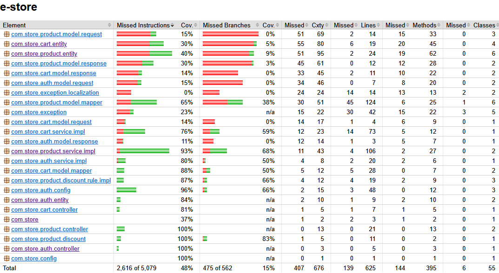

# E-Commerce Backend

This project is the Java backend for a web-based electronics store’s checkout system. It provides a **RESTful API** for managing authentication, products, and customer operations.
## Getting Started

### Prerequisites
- Java 17+
- Maven
- Docker

### Installation

#### 1. Clone the repository:
```sh
git clone https://github.com/duyngq/e-commerce.git
cd ecommerce
```
#### 2. Build the project:
```sh
mvn clean install -DskipTests
```
#### 3. Execute the test cases:
```sh
mvn test
```
#### 4. Retrieve the test coverage report
```sh
e-commerce\target\site\jacoco\index.html
```
Coverage report:


#### 6. Test case implementation strategy
 - Start full application
 - Start in-memory database (H2 in this case)
 - Run test cases with mockmvc to send request to the application as real client
 - Using jacoco to generate code coverage report

### Running the Application
##### Run with docker compose
```sh
docker compose up
```
##### Note
- The latest is pushed to docker hub under my account: duyngq/e-commerce
- The application will be running on port 8080.
- The database will be running on port 3306.
- The database schema will be created at boot - make sure the folder structure like
  - /mysql-init-scripts
    - init_database.sql
  - docker-compose.yml

### Access to Swagger API documentation
```sh
http://localhost:8080/swagger-ui/index.html
```

### Consume some API endpoints
#### Authentication
- User list
```sh
Admin role: admin/admin123
Customer role: customer/cust123
```
- Login
 ```sh
  curl -X 'POST' \
  'http://localhost:8080/api/auth/login' \
  -H 'accept: */*' \
  -H 'Content-Type: application/json' \
  -d '{
  "username": "admin",
  "password": "admin123"
  }'
```

- Register a new user
```sh
curl -X 'POST' \
  'http://localhost:8080/api/auth/register' \
  -H 'accept: */*' \  
  -H 'Content-Type: application/json' \
  -d '{
  "username": "admin1",
  "password": "admin1234",
  "role": "ADMIN"
  }'
```
#### Product
- Create a new product
```sh
  curl -X 'POST' \
  'http://localhost:8080/api/v1/products' \
  -H 'accept: */*' \
  -H 'Authorization: Bearer <Token>' \
  -H 'Content-Type: application/json' \
  -d '{
  "name": "prod1",
  "price": 123,
  "discounts": [
  ]
  }'
  ```
- Update discount for products
```sh
  curl -X 'PUT' \
  'http://localhost:8080/api/v1/products/discounts' \
  -H 'accept: */*' \
  -H 'Authorization: Bearer <Token>' \
  -H 'Content-Type: application/json' \
  -d '[
  {
  "productId": 1,
  "discountId": 2
  },
 {
  "productId": 2,
  "discountId": 2
  }
  ]'
  ```
- Delete products
```sh
curl --location --request DELETE 'http://localhost:8080/api/v1/products' \
  --header 'Content-Type: application/json' \
  --header 'Authorization: Bearer <Token>' \
  --data '[
  1,2,4
  ]'
```

#### Cart
- Add product to cart
```sh
curl -X 'POST' \
  'http://localhost:8080/api/v1/cart' \
  -H 'accept: */*' \
  -H 'Authorization: Bearer <Token>' \
  -H 'Content-Type: application/json' \
  -d '[
  {
    "productId": 1,
    "quantity": 1
  }
]'
```
- Update product quantity in cart
```sh
curl -X 'PUT' \
  'http://localhost:8080/api/v1/cart/1' \
  -H 'accept: */*' \
  -H 'Authorization: Bearer <Token>' \
  -H 'Content-Type: application/json' \
  -d '[
  {
    "productId": 1,
    "quantity": 10
  },
{
    "productId": 2,
    "quantity": 10
  }
]'
```
- Checkout cart
```sh
curl -X 'GET' \
  'http://localhost:8080/api/v1/cart/checkout/<cartId>' \
  -H 'accept: */*' \
  -H 'Authorization: Bearer <Token>'
```

#### Feature list
#### DONE
- [x] Implement the authentication feature
- [x] Implement the product management feature
- [x] Implement the cart management feature
- [x] Implement the discount management feature

#### TODO
- [ ] Implement refresh token feature
- [ ] Implement the logging feature
- [ ] Refactor the code to remove boilerplate code/structure in controller and service layers
- [ ] Handle inventory management
- [ ] Implement localization for exception messages
- [ ] Enhance discount algorithm to support more complex scenarios and improve the performance 